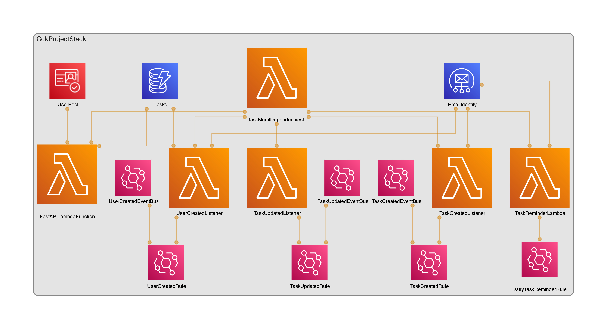

# AWS Task Management Application

A comprehensive, enterprise-grade task management system built with FastAPI and AWS services, featuring advanced user authentication, role-based access control, real-time notifications, and scalable infrastructure.

## Table of Contents
- [Architecture Overview](#architecture-overview)
- [Technical Stack](#technical-stack)
- [Features Deep Dive](#features-deep-dive)
- [Project Structure](#project-structure)
- [API Documentation](#api-documentation)
- [Setup and Installation](#setup-and-installation)
- [Development Guide](#development-guide)
- [AWS Infrastructure](#aws-infrastructure)
- [Security Implementation](#security-implementation)
- [Monitoring and Logging](#monitoring-and-logging)
- [Troubleshooting Guide](#troubleshooting-guide)
- [Contributing Guidelines](#contributing-guidelines)
- [License](#license)

## Architecture Overview

### System Architecture
The application implements a serverless microservices architecture leveraging various AWS services:

- **API Layer**: FastAPI application deployed as AWS Lambda functions
- **Authentication**: AWS Cognito User Pools with custom authentication flows
- **Database**: DynamoDB with optimized access patterns
- **Event Processing**: EventBridge for asynchronous event handling
- **Infrastructure**: AWS CDK for Infrastructure as Code (IaC)
- **Notifications**: AWS SES for email notifications
- **Deployment**: AWS Lambda with custom layers

### Data Flow
1. Client requests authenticated through Cognito
2. Lambda executes FastAPI application code
3. DynamoDB handles data persistence
4. EventBridge manages async events
5. SES handles email notifications

## Technical Stack

### Backend Framework
- FastAPI
- Pydantic for data validation
- Mangum for AWS Lambda integration

### AWS Services
- AWS Lambda: Serverless compute
- Amazon DynamoDB: NoSQL database
- Amazon Cognito: User authentication
- Amazon EventBridge: Event management
- Amazon SES: Email services
- AWS CDK: Infrastructure as code

### Development Tools
- Python 3.9+
- AWS CDK v2
- boto3 for AWS SDK

- black for code formatting

## Features Deep Dive

### Authentication System
#### Admin Authentication
- Custom JWT token generation
- Role-based access validation
- Session management
- Password policies enforcement

```python
@router.post("/login", summary="Admin Login")
async def admin_login(credentials: AdminUserLogin):
    secret_hash = utils.generate_secret_hash(
        my_env_vars.get("COGNITO_APP_CLIENT_ID"),
        my_env_vars.get("COGNITO_APP_CLIENT_SECRET"),
        credentials.email
    )
    # ... authentication logic
```

#### Team Member Authentication
- Separate authentication flow
- Group-based permissions
- Password reset functionality

### Task Management
#### Task Creation
- Unique task ID generation
- Automatic timestamp assignment
- Task assignment validation
- Event triggering for notifications

```python
@router.post("/create", status_code=status.HTTP_201_CREATED)
async def create_task(task: Task, token: str = Depends(oauth2_scheme)):
    utils.verify_token(token, "Admins")
    task.task_id = utils.generate_task_id()
    task.created_at = time.strftime("%Y-%m-%d %H:%M:%S")
    # ... task creation logic
```

#### Task Updates
- Status tracking
- Deadline management
- Assignment changes
- History tracking

### User Management
#### Team Member Creation
- Automatic password generation
- Email verification
- Group assignment

#### User Updates
- Profile management
- Role updates
- Status tracking
- Access control updates

## Project Structure

Detailed breakdown of the project structure:

```
├── app/
│   ├── db/
│   │   ├── task.py           # Task database operations
│   │   └── user.py           # User database operations
│   ├── routers/
│   │   ├── admin/
│   │   │   ├── auth.py       # Admin authentication
│   │   │   ├── task_mgmt.py  # Task management
│   │   │   └── user_mgmt.py  # User management
│   │   └── user/
│   │       ├── auth.py       # User authentication
│   │       └── task_mgmt.py  # Task operations
│   ├── utils/
│   │   ├── CognitoAuthenticator.py  # Cognito integration
│   │   └── utils.py          # Utility functions
│   ├── main.py              # Application entry point
│   └── models.py            # Data models
├── cdk-project/
│   ├── app.py               # CDK app entry point
│   ├── cdk_project_stack.py # Infrastructure stack
│   └── utils.py             # CDK utilities
├── lambda_layer/            # Lambda layer dependencies
├── tests/
│   ├── unit/               # Unit tests
│  
└── requirements.txt        # Project dependencies
```

## API Documentation

### Admin Routes

#### Authentication
```
POST /api/v1/admin/auth/login
```
Request body:
```json
{
    "email": "admin@example.com",
    "password": "secure_password"
}
```
Response:
```json
{
    "access_token": "jwt_token",
    "user": {
        "username": "admin_user",
        "email": "admin@example.com",
        "given_name": "Admin",
        "family_name": "User",
        "user_group": ["Admins"]
    }
}
```

[others can be found at the 
<root_of_where_this_project_will_be_hosted>/docs...]

## Setup and Installation

### Prerequisites
- Python 3.9+
- AWS Account with appropriate permissions
- Node.js 14+ (for CDK)
- AWS CLI configured

### Local Development Setup

1. **Clone and Setup Virtual Environment**
```bash
git clone <repository-url>
cd aws-task-mgmt-app
python -m venv virtualenv
source virtualenv/bin/activate  # On Windows: virtualenv\Scripts\activate
```

2. **Install Dependencies**
```bash
pip install -r requirements.txt
pip install -r requirements-dev.txt  # Development dependencies
```

3. **Configure Environment Variables**
```bash
Creare .env file with the following variables:


MY_AWS_REGION=us-east-1
COGNITO_USER_POOL_ID=<your-user-pool-id>
COGNITO_APP_CLIENT_ID=<your-app-client-id>
COGNITO_APP_CLIENT_SECRET=<your-app-client-secret>
DYNAMODB_TABLE_NAME=<your-table-name>

```

### AWS Infrastructure Deployment

1. **Install CDK Dependencies**
```bash
cd cdk-project
npm install -g aws-cdk
pip install -r requirements.txt
```

2. **Deploy Infrastructure**
```bash
cdk bootstrap
cdk synth
cdk deploy
```

3. **Update Environment Variables**
After deployment, update your `.env` file with the output values from CDK deployment.

## Development Guide

### Code Style
- Follow PEP 8 guidelines
- Use type hints
- Document functions and classes
- Use meaningful variable names

## AWS Infrastructure

### DynamoDB Schema
#### Tasks Table
```
Primary Key: task_id (String)
Attributes:
- title (String)
- description (String)
- deadline (String)
- task_status (String)
- created_at (String)
```


### Cognito Setup
- User Pool with email authentication
- Custom attributes for user profiles
- Separate app clients for admin and users
- Custom password policies

### Lambda Configuration
- Memory: 256 MB
- Timeout: 30 seconds
- Runtime: Python 3.9
- Custom layers for dependencies

## Security Implementation

### Authentication Flow
1. User submits credentials
2. Cognito validates credentials
3. JWT tokens generated
4. Tokens validated on subsequent requests

### Authorization
- Role-based access control
- Token validation on each request
- Resource-level permissions
- API Gateway authorization

### Data Security
- Encryption in transit
- Secure password handling
- Input validation

## Monitoring and Logging

### CloudWatch Integration
- Lambda function logs(Cloudwatch log groups)


## Troubleshooting Guide


## License

This project is licensed under the MIT License - see the [MIT](LICENSE) file for details.

---

## Support and Contact

For support, please contact zaidanali028@gmail.com

---

*Last updated: January 2025*

